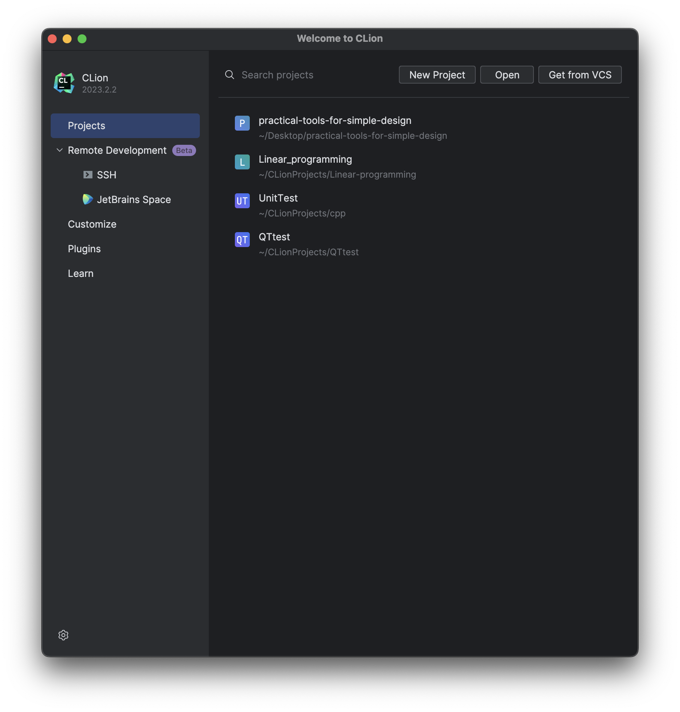
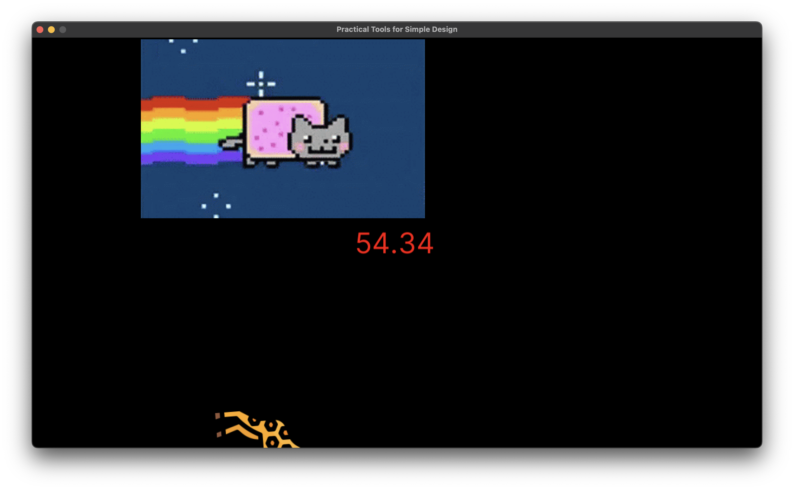
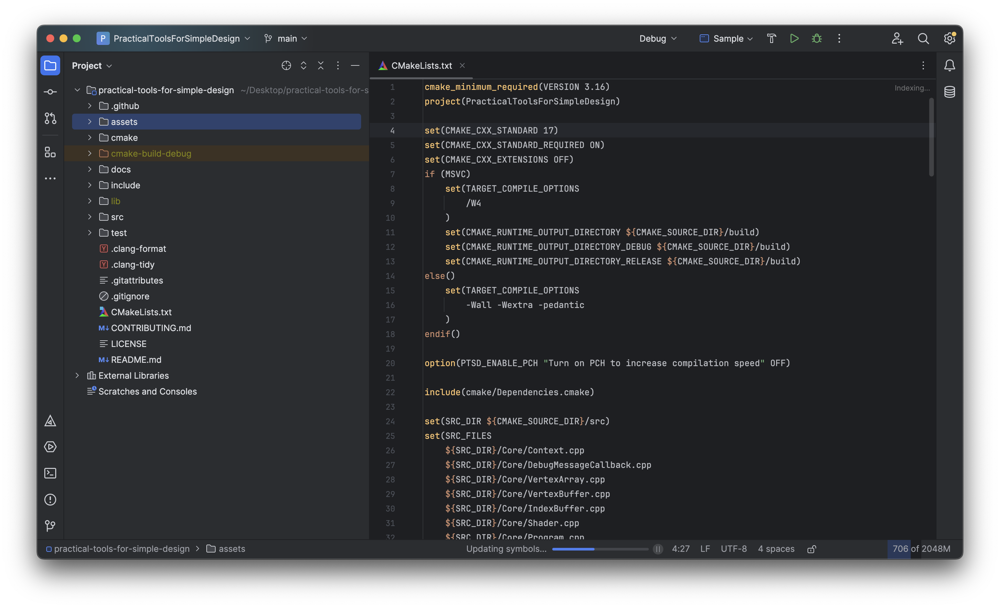

# Clion

首先先把 PTSD 下載下來。

```bash
git clone https://github.com/ntut-open-source-club/practical-tools-for-simple-design.git
```

之後在 Clion 中將它開啟，點擊 PTSD。


出現了一個設定 `Cmake` 的畫面，而這邊開始展現下一步大法...

或需你會發現右上角的 `RUN` 或者 `DEBUG` 按鈕是不能按的狀態，這是因為 Clion 正在編譯 Cmake，你可以在右下角看到有一個進度條。


這邊點擊右上角的 `RUN` Button，此刻你就能看到他正在連結每一個檔案了，讓他跑一下。



等他跑完之後就會出現一隻可愛的貓貓，至此就完成了整個專案的調整。


恭喜你，已經完成整個 PTSD 的下載了，可以開始編寫屬於你自己的遊戲了。
