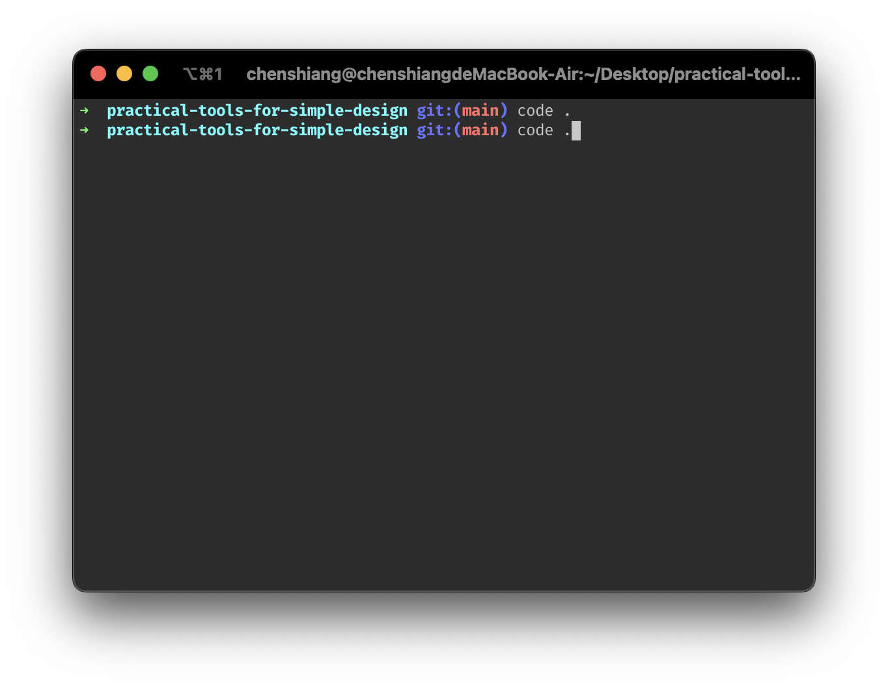
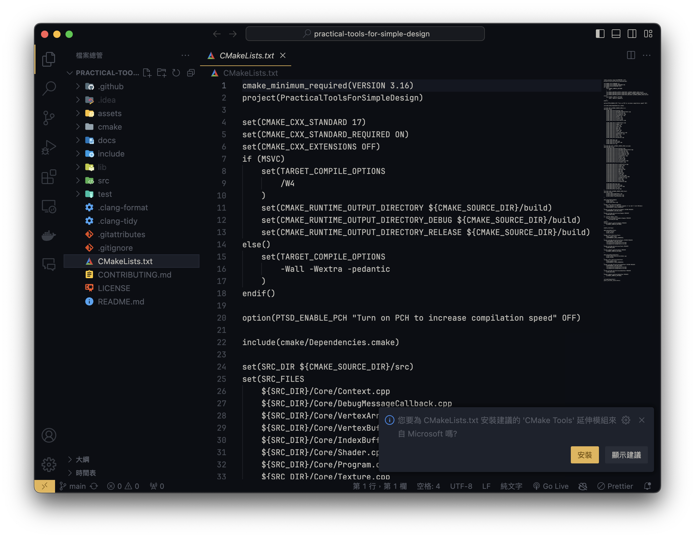
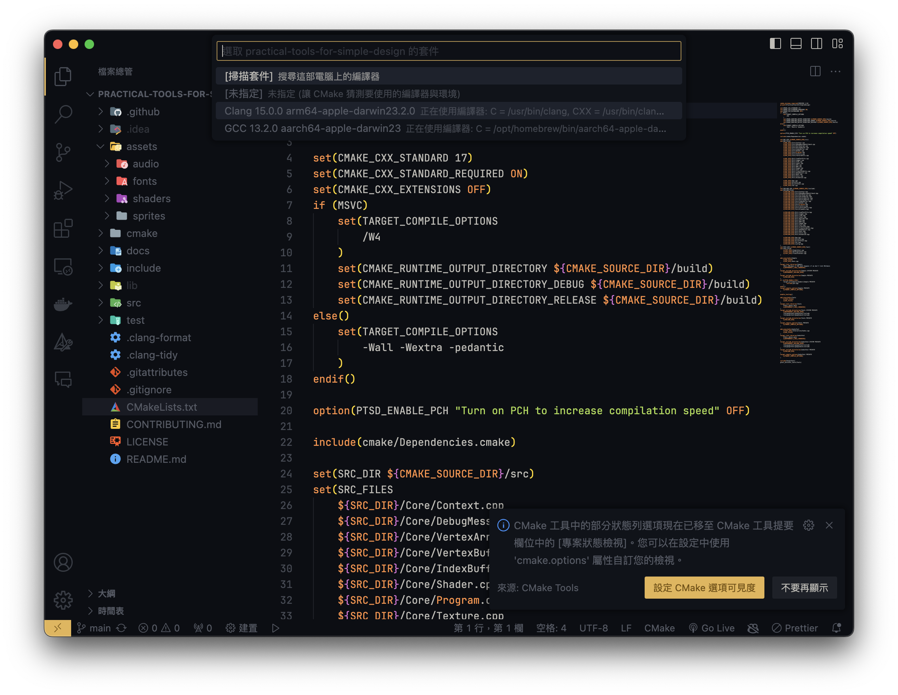
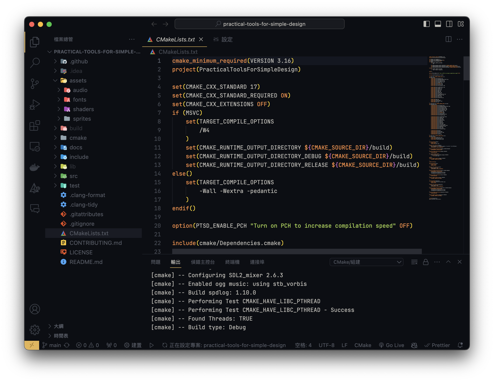
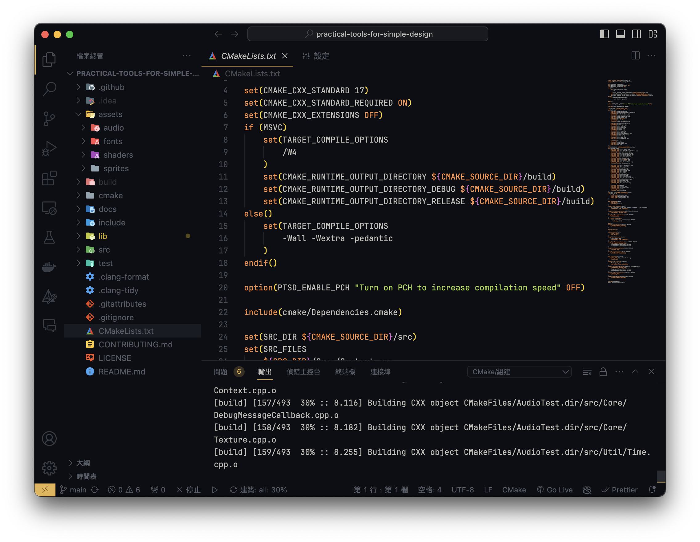

# vscode

先把 PTSD 下載下來。

```bash
git clone https://github.com/ntut-open-source-club/practical-tools-for-simple-design.git
```

之後用 vscode 打開它。



安裝 `Cmake`。



哈哈，其實我也沒裝 cmake 拉。


選擇編譯器，而操作的電腦是 MAC 所以就選擇了 `Clang`。



可以看到他正在編譯。


接下來提示說已經編譯完成，且編譯完成的檔案在 `build` 資料夾。接下來你有看到 vscode 左下角有一個播放鍵，那是 `cmake` 的執行按鈕，按下去之後選擇 `simple`，再來你就會看到貓貓了。



wtf, 這畫面超ㄎㄧㄤ的 ww。

